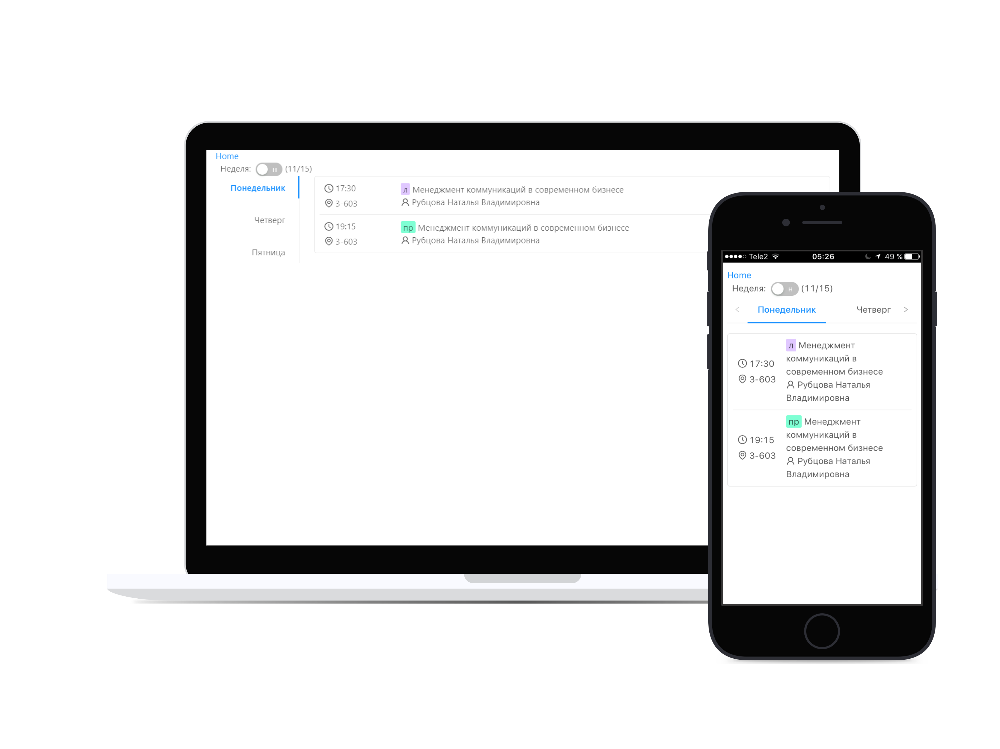
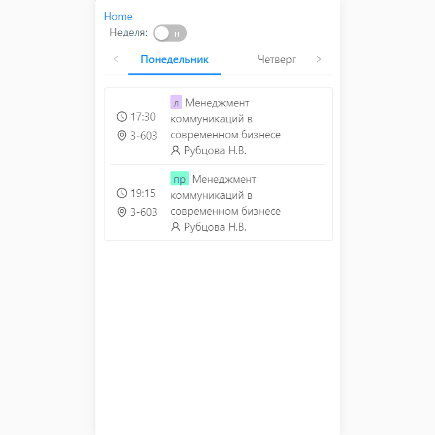
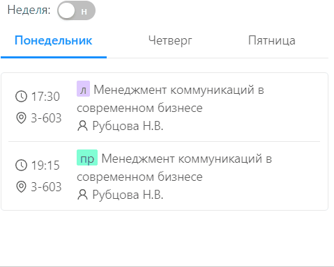
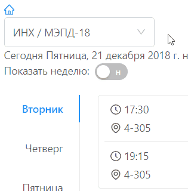
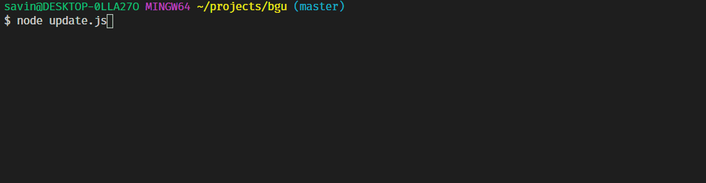

# Schedule for Baikal State University students (Irkutsk)

This is [React.js](https://reactjs.org) based single page progressive web application. This application is designed from scratch by [Yury Savin](https://github.com/baitun).  

App is available here: [http://bgu.irkvuz.ru](http://bgu.irkvuz.ru?from=gh)  

[](https://bgu.irkvuz.ru?from=gh)

На отдельной странице описал [какие цели я ставил перед сабой при разработке этого приложения](docs/GOALS.md).

## Features

Есть так же [описание преимуществ на русском языке](docs/FEATURES.md)

### Fully Responsive

Works well on both desktop and mobile, large screen and small screen.



### Switch between odd/even week



### Works offline

You don't need internet connection to get access to your schedule

### Quick group selection

Fast switching between groups and search by groups / faculties




### Daily automatic updates from the official site

To update schedule run script [scripts/updateSchedule.js](./scripts/updateSchedule.js) (`node scripts/updateSchedule.js` or `yarn updateSchedule`)



## Getting Started

To start contributing just fork and clone this repo.

```sh
git clone https://github.com/irkvuz/schedule
cd ./schedule
# install all dependencies
yarn install
# download lists and schedule for all groups from http://mobile.bgu.ru/ to /public/data/ 
# for details see file ./scripts/updateSchedule.js
yarn updateSchedule
# start development server
yarn start
```

## Built With

* [React.js](https://github.com/facebook/react) - JavaScript library for building user interfaces
* [React Router](https://github.com/ReactTraining/react-router) - declarative routing for React
* [Axios](https://github.com/axios/axios) - promise based HTTP client for the browser and node.js
* [Create React App](https://github.com/facebook/create-react-app) - create React apps with no build configuration
* [Ant Design](https://github.com/ant-design/ant-design) - an enterprise-class UI design language


## Contacts

If you have any questions, feel free to contact me via Telegram: [@savinyurii](https://tele.click/savinyurii)

## License

This project is licensed under the MIT License.  
Copyright (c) [Yury Savin](http://baitun.github.io). All rights reserved.
